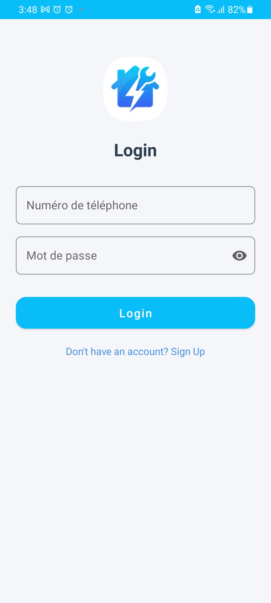
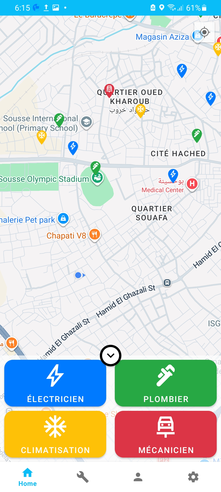
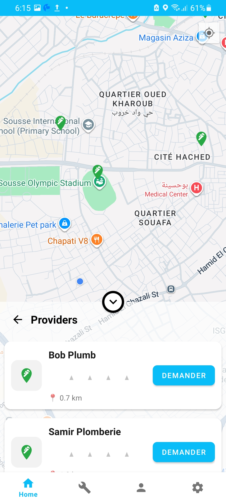
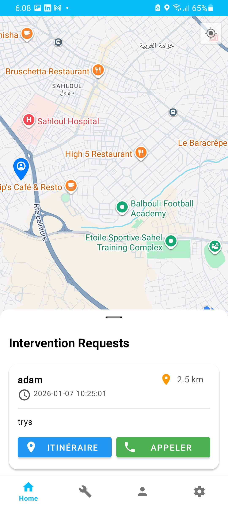
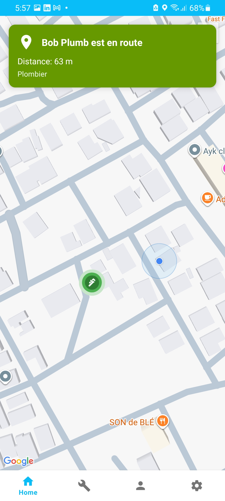
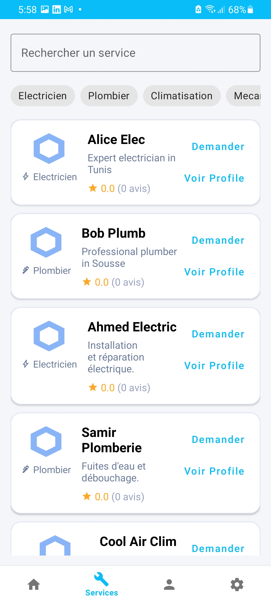
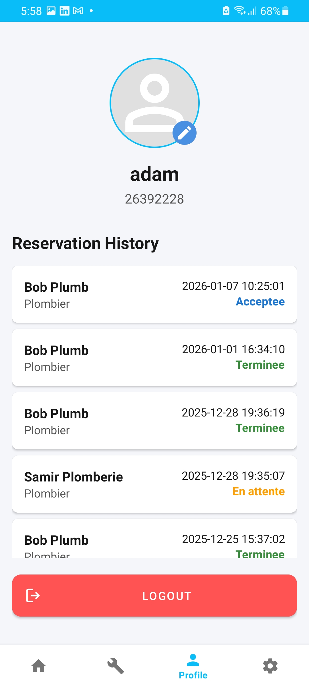

# MyProject

MyProject is an Android home-services app with two roles:
- Client: browse providers, request interventions, track provider arrival, submit review.
- Provider: receive requests, accept/deny, navigate/call client, complete intervention, share location.

Backend is a PHP + MySQL API.

## Features
- Signup and login
- Role-based home screen (client/provider)
- Provider list/map views with filtering
- Intervention booking and status flow
- Live location updates and tracking
- Rating and review after completion
- Profile/history and dark mode setting

## Stack
- Android: Kotlin, Fragments, ViewBinding, RecyclerView
- Networking: Retrofit, Gson, OkHttp
- Maps/Location: Google Maps SDK, Fused Location Provider
- Backend: PHP, MySQL

## Project Structure
- `app/` Android app
- `php_api/` PHP backend endpoints

## Screenshots
<table>
  <tr>
    <td align="center"><strong>Login</strong> </td>
    <td align="center"><strong>Client Home Map</strong> </td>
  </tr>
  <tr>
    <td align="center"><strong>Service Search</strong> </td>
    <td align="center"><strong>Provider Requests</strong> </td>
  </tr>
  <tr>
    <td align="center"><strong>Intervention Tracking</strong> </td>
    <td align="center"><strong>Services Tab</strong> </td>
  </tr>
  <tr>
    <td align="center" colspan="2"><strong>Profile History</strong> </td>
  </tr>
</table>

Click any screenshot to open the full-size image.

## Quick Start (Local)
1. Copy `php_api` to XAMPP htdocs as `my_api`:
  - `C:/xampp/htdocs/my_api`
2. Start Apache and MySQL in XAMPP.
3. Create database `home_services_db`.
4. Configure DB credentials in `php_api/db_connect.php`.
5. Open Android project in Android Studio and sync Gradle.
6. Add Google Maps API key in `app/src/main/AndroidManifest.xml`:
  - replace `YOUR_API_KEY_HERE`
7. Run app on emulator.

Default local API URL is already configured for emulator:
- `http://10.0.2.2/my_api/`

## API Base URL Configuration
The app now reads API base URL from Gradle property `MYPROJECT_API_BASE_URL`.

Current default (in `gradle.properties`):
- `http://10.0.2.2/my_api/`

To use a physical device on the same Wi-Fi network, set:
- `http://<YOUR_PC_LAN_IP>/my_api/`

To use a hosted server, set:
- `https://<your-domain>/my_api/`

Recommended setup for team or public repositories:
1. Open `%USERPROFILE%/.gradle/gradle.properties`
2. Add:
  - `MYPROJECT_API_BASE_URL=https://your-server-or-lan/my_api/`

## Notes
- Runtime URL path must match your deployed folder path.
- If your app URL ends with `/my_api/`, backend must be served under `/my_api/`.
- `android:usesCleartextTraffic="true"` is enabled, so local HTTP works.

## Suggested Improvements
- Add a database schema SQL file (for example: `php_api/schema.sql`) to make local setup one command.
- Move API and Maps keys to `local.properties`/environment-based config and keep placeholders in tracked files.
- Add one seed script for demo accounts (client/provider) to make screenshots and testing faster.
- Add a short API response contract section per endpoint (required fields + success/error examples).

## API Endpoints
- `login.php`
- `signup.php`
- `get_user_details.php`
- `get_service_providers.php`
- `create_intervention.php`
- `get_user_interventions.php`
- `get_provider_interventions.php`
- `update_intervention_status.php`
- `update_provider_location.php`
- `update_client_location.php`
- `get_active_intervention.php`
- `mark_provider_arrived.php`
- `complete_intervention.php`
- `submit_review.php`
